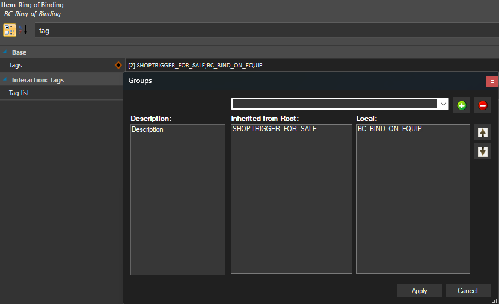
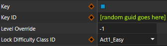

# DEV RESOURCES

## How to Create your own Curse of Binding Equipment (Via Toolkit)

Add the `BC_BIND_ON_EQUIP_8bcdba4a-8d05-4119-8bb5-54b3f5f43fde` tag to your item. This tag makes the item unequippable after wearing it.



If you want your item to be lockpickable, do the following:



- `Key`: Set to `true` to prevent it from being locked by default.
- `KeyID`: Set to a random GUID.
- `LockDifficultyClassID`: chose any appropriate value.


## If you're not using the Official Toolkit, here's how the Ring of Binding properties look like:

```xml		
<node id="GameObjects">
    <attribute id="MapKey" type="FixedString" value="7299c4be-287a-4c21-80b7-9ff64ae8cb99" />
    <attribute id="Name" type="LSString" value="BC_Ring_of_Binding" />
    <attribute id="LevelName" type="FixedString" value="" />
    <attribute id="Type" type="FixedString" value="item" />
    <attribute id="ParentTemplateId" type="FixedString" value="65bb04bb-4313-4446-b250-727a712000c9" />
    <attribute id="DevComment" type="LSString" value="Example ring that has the binding curse" />
    <attribute id="DisplayName" type="TranslatedString" handle="h08de1f6aga313g26e6gad1bg44e76e7280ae" version="9" />
    <attribute id="Icon" type="FixedString" value="Item_LOOT_GEN_Ring_I_Gold_A_1" />
    <attribute id="LockDifficultyClassID" type="guid" value="31e92da6-bac9-46f7-af99-5f33d98fd4f0" />
    <attribute id="Key" type="FixedString" value="0bcf5928-b7d9-4eb1-b40a-e6ff3f6d2630" />
    <attribute id="IsKey" type="bool" value="True" />
    <attribute id="Description" type="TranslatedString" handle="h7fe0b48fg8797g781agd6cdg9abe9594e916" version="9" />
    <children>
        <node id="Tags">
            <children>
                <node id="Tag">
                    <attribute id="Object" type="guid" value="8bcdba4a-8d05-4119-8bb5-54b3f5f43fde" />
                </node>
            </children>
        </node>
    </children>
</node>
```

## Bind Equipment Using a Status

Apply the status `BC_CURSE_OF_BINDING` to an item to make it bound.

- If the item is **already equipped**, the binding takes effect immediately.  
- If the item is **not equipped**, the binding will activate once the item is equipped.  
- Removing the status will also remove the binding effect.

## Require a Unique Key to Unlock Equipment

To prevent an item from being unlocked with the default `Key of Unbinding`, and instead require a custom key:

1. Add the tag `BC_REQUIRES_UNIQUE_KEY_38c6509a-a249-457c-954d-98dc8238e339` to the target item.  
2. Create your custom key item and set its `Key` value to match the target item's `NAME_GUID`.  
   - This links the key specifically to that item.  
   - 
3. *(Optional)* Add the tag `BC_CONSUME_KEY_ON_USE_0bb35d6c-684e-435e-b32c-802b34d9ed4b` to the key item if you want it to be consumed when used.

## Limitations?

`Unequip` calls via a script will work as normal, this mod will make no attempt in re-equipping any cursed items that are externally removed as that will likely cause a load of unintended effects.